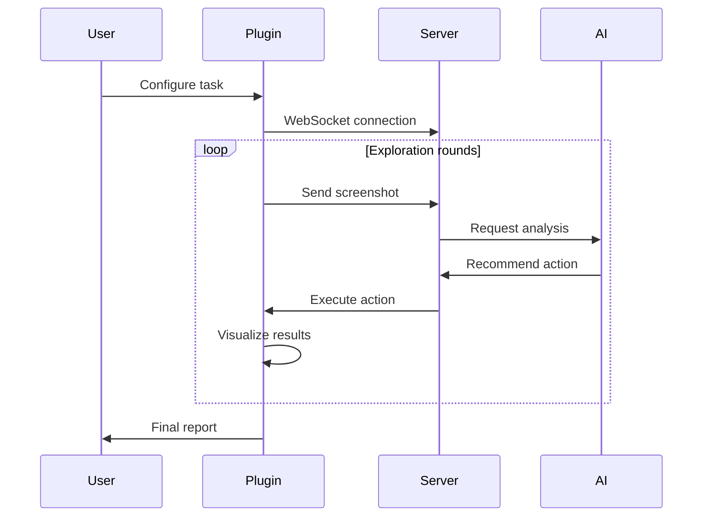

# Klever UT (Usability Test) Plugin for Figma

Klever UT is a Figma plugin that automates usability testing of Figma designs using AI technology.

## Key Features

- **Real-time Design Exploration**: Real-time design analysis through WebSocket
- **Automated Usability Testing**: AI explores designs based on specified tasks and personas
- **Visual Feedback**: Visualizes exploration process and results in Figma frames
- **Detailed Reports**: Provides detailed analysis results for each step

## Getting Started

1. **Install Dependencies**
   ```bash
   yarn install
   yarn build:watch  # Start development build with auto-reload
   ```

2. **Add to Figma**
   - In Figma, select `Plugins` → `Development` → `Import plugin from manifest...`
   - Choose the `manifest.json` file from the project

3. **Check Server Connection**
   - Verify connection status indicator in the top right when running the plugin
   - Click reconnect button if connection issues occur

## How to Use

### 1. Initialization
- Enter Figma file URL
- Input password if required
- Verify connection status

### 2. Task Configuration
- Enter test task description
- Set persona (optional)
- Start exploration

### 3. Report Generation
- Monitor real-time exploration progress
- Review automatically generated analysis frames
- Check final report

## System Architecture

### Core Components
1. **React UI (src/app)**
   - Step components (InitStep, TaskStep, ReportStep)
   - Modal components (ConfirmModal, PersonaModal)
   - State management (WebSocket, exploration progress)

2. **Figma Plugin Core (src/plugin)**
   - Figma API communication
   - Frame creation and management
   - Image processing

3. **WebSocket Communication**
   - Real-time status updates
   - AI model communication
   - Action execution and result collection

### Exploration Process




## Development Notes

- WebSocket connection set to `localhost:8080`
- Maximum exploration rounds: 30
- Inefficient action caching prevents duplicate exploration
- Event-driven architecture for real-time status updates

## Important Notes

- Server must be running to use the plugin
- Stable network connection required
- Initial loading time may be longer for large Figma files
- All WebSocket communications are restricted to localhost for security

## Technical Requirements

- Node.js 14+
- Yarn package manager
- Modern web browser
- Active Figma account with plugin development permissions

## Contributing

1. Fork the repository
2. Create your feature branch
3. Commit your changes
4. Push to the branch
5. Create a new Pull Request

## License

This project is licensed under the MIT License - see the LICENSE file for details.